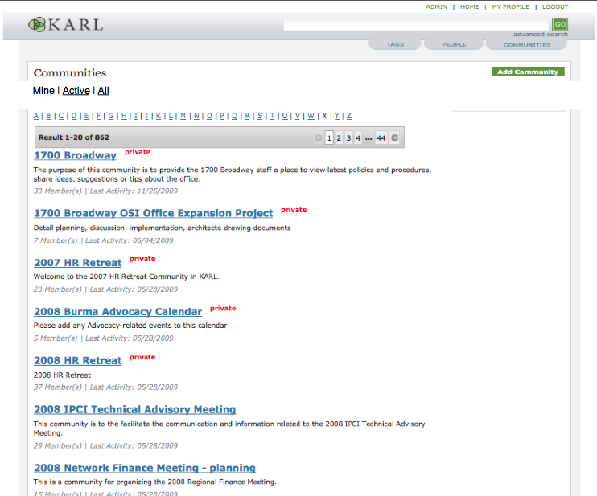
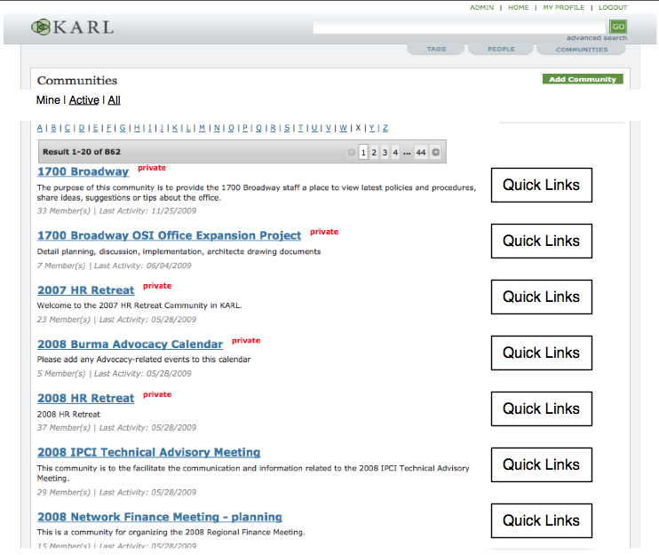

===================
Community Discovery
===================

The Communities Homepage (reached via clicking on the COMMUNITIES tab)
is a vital part of KARL.  For affiliates, this is their homepage.  For
staff, it is a page they frequently go to see their list of
communities and find new information in other public communities.

This proposal attempts to improve the use of this page.

Background
==========

KARL has 3 top-level facilities that span across KARL and are
represented as site tabs: TAGS, PEOPLE, and COMMUNITIES.  The
COMMUNITIES tab leads to a page that serves 2 different use cases:

#. **Take me to my stuff quickly.**.  Making it super-easy to
   contribute content is a core part of KARL.  Users contribute
   content in communities.  Thus, it is important to make it quick to
   get to the right community.  This is fulfilled via the ``My Communities``
   portlet today.

#. **Surprise me with new stuff.** Staff (but not affiliates) see a
   listing of all public communities as well as the private
   communities they are members of.  This allows them to browse new
   communities and content, potentially finding (and joining) new
   efforts.

These two use cases are served in the same page.  There is a portlet
for the former and a paginated box for the latter.

Flaws in the current page:

#. **Hard to find new stuff**.  We simply provide a flat listing of
   every community you have access to, along with count of members and
   last activity.  With over a thousand communities, this is
   inadequate.

#. **Unwieldy when member of many communities.** The portlet doesn't
   scale at all.

#. **Wrong for affiliates.** There is no point showing the "My
   Communities" portlet, since they only can see their communities in
   the main listing.  Stated differently, affiliates can't "discover"
   communities.

Under an initial proposal, the page would beef up support for
fulfilling these different use cases in the same page.  The "My
Communities" portlet would become richer (for the first use case), the
communities listing would become richer (to fulfill the second use
case), and an editorialized "Feature" would be added in the dominant
positioning on the screen.

This initial proposal has a number of strengths, but also some drawbacks:

#. We still mix multiple "modes" on the same screen, trying to fill
   use cases that are, realistically, in opposition to each other.
   The result is that we'll do a poor job at each individual goal, as
   they either get less of the screen or get shoved down below the
   first screenful.

#. We add stuff to the screen that affiliates can't see.  For example,
   the "Feature" will point at something they don't have access to and
   thus can't "discover".  In fact, "discoverability" can't be added
   to the Communities screen for affiliates, by design.

This proposal tries to incorporate the goals expressed, but presented
in a different manner.

Goals
=====

#. Increase ways that staff can "discover" new communities.

#. Make navigation of My Communities far more productive when there
   are many communities.

#. Allow users primarily interested in one mode (existing
   vs. discoverability) to see what they want when they want it.

#. Ensure that affiliates see a Communities page that doesn't steer
   them towards discoverability.

#. Produce results in iterations, to better estimate cost and get
   feedback for which we can modify course.

#. Collect new ideas for connecting dots and improving signal-to-noise
   ratio.

Overall Proposal
================

This proposal is broken into stages of changes that can be rolled into
production.  Still, it is worthwhile to see the overall direction
taken.

#. **Use submenus to optimize for different goals**.  Some people
   (e.g. Chipp) want to quickly get to their work.  Others (Nat,
   Jonathan) want to start with a big picture view.

   We had a similar issue for the new calendar.  Some people liked one
   view versus another.  We resolved that by having multiple views,
   but making each user's last selected view "sticky" (by using a
   cookie.)  Thus, when you clicked "CALENDAR" the next time, you got
   the view you wanted.

   We propose the same for the "COMMUNITIES" tab.  Have multiple views
   on the data.  Whenever you choose a view, it is sticky, and
   clicking on "COMMUNITIES" shows you ``/communities/`` but with your
   last view selected by default.

#. **Optimize each view for the task at hand.** Submenus let us
   optimize each view for the use case at hand, giving them full width
   of the screen.  Done correctly, they also release us from the
   affiliates trap.  That is, they only have views that are meaningful
   for them.

#. **Use the existing Feature for the Feature**.  As noted above, the
   Featured Community idea is only meaningful for staff.  We already
   have an underused facility for featuring content for staff: the
   intranet Feature that appears in the middle column.  It is already
   in need of more frequent content to appear in it.

   Later, if it outgrows that slot, we can have a submenu that shows
   featured communities.

#. **Productivity**.  When showing the "My Communities" view, we can
   improve the visual display on each entry, to make it more useful
   and productive.  As a very simple example, we can provide links to
   jump directly to the blog, wiki, files, and calendar for that
   community.

#. **Richer connections**.  Discoverability of communities means using
   information in the system to propose connections.  We can add to
   the information collected, to provide better ways to connect the
   dots.  We can also decide that discoverability of communities to
   participate in, is different than discovering content to consume.
   For the latter, we provide other facilities with other ideas.

Step One: Dedicated Views
=========================

In this first step, we make some quick, non-controversial changes that
immediately improve each use case while also improving the
signal-to-noise ratio.

#. Introduce a submenu with 3 different subviews for COMMUNITIES.
   Affiliates don't get any submenus, since they can only see their
   communities. 

#. Make the selection of a subview "sticky".

#. The first 3 submenus go to My Communities, Active Communities, and
   All Communities.

#. Remove the "My Communities" portlet.  This gives the full width of
   the screen for the UI (e.g. the results batch box.)

#. "My Communities":

   - Gains batching and letter selection as ways to navigate a long
     list of a user's communities.

   - Presents more information about each of your communities.
     Perhaps the same information shown currently when showing all
     communities (title, description, number of members, last
     updated.)  Can change over time to be more condensed, or to
     provide more productivity.

   - Improve the display of which community you are a moderator of.
     Instead of using bold, put a badge just before the number of
     members.  This makes vertical scanning easier.

#. "Active Communities":

   - Uses the same paginated layout, but filters based on recent
     activity.  This improves signal-to-noise, enhancing
     discoverability by filtering out inactive communities.

   - The submenu has a tooltip explaining what "active" means (last
     updated in previous six months, for example.)

#. "All Communities":

   - Exactly as it is now, but with more of the page width.

This first step provides a number of gains with little cost/risk.

Estimated effort: 3 ideal days.

Step 2: Quick Links
===================

After step one, we have more space available on the screen for each
task.  We can put this space to use by introducing elements specific
to that task.

That is, each view can have a float-right box that provides "quick
links" for that community.  This box can be native to that task.  For
example, when doing "My Communities", this box might have links
directly to the blog, wiki, files, or calendar tools.  For "All
Communities" (discoverability), this might show extra connections to
"related" projects.

Notes
=====

- Do affiliates see a My Communities?

- Use a cookie to track which communities you recently went into.

- Jonthan's dropdown menu.
