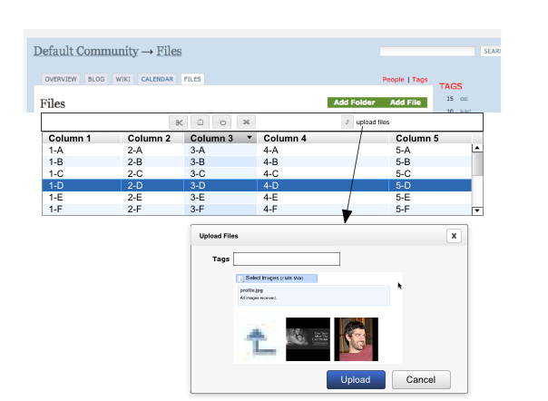
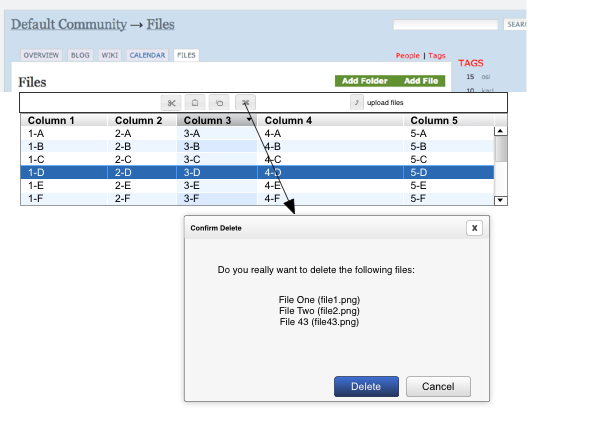
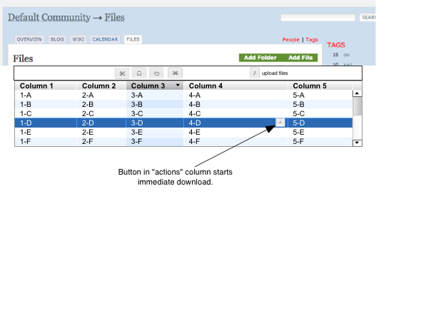

===================
Enhanced FILES Tool
===================

The highest priority enhancement for KARL3 is "Enhanced FILES Tool".
This proposal describes the features proposed, then provides a
user-centered discussion of certain operations.  Additionally, open
questions and technical points are discussed.

Design Points and Constraints
=============================

- Bookmarks and emailed-URLs.  Tom should be able to drill-down into a
  resource, cut-and-paste the URL, and email it to Yalan.  When Yalan
  clicks the link, she should get to the view Tom had.  Ditto for
  bookmarks.

- Not a complete reinvention.  We keep aspects of the current UI
  (e.g. show the title of the resource at the current URL, plus
  actions possible on that resource and the tags on that resource) in
  their same spots, untouched.  This promotes consistency with how
  features are presented across types of content.

Proposed Features
=================

The following sections list features proposed for KARL 3.0, then
features that are collected and specified for implementation later.

For both sections, features are listed in the order they will be
implemented.  This helps further narrow prioritization: when budget
runs out, you go with what has been implemented at that point.

KARL 3.0 Features
-----------------

#. **Common Ajax Improvements**.  The improved Ajax infrastructure
   provides some enhancements that this tool will gain by default:

   - *Faster first-load*.  We will embed the data for the first screen
     in the HTML for the page itself, rather than making an Ajax
     request after pageload to get the initial data.

   - *Faster second operations*. Operations such as pagination and
      column sorting will be faster because they will be done
      "in-place".  Meaning, we don't change the URL of the page to
      re-fetch all the content on the page.  Instead, we just update
      the grid with new data.  Faster perceived performance by the
      user, less network traffic, and less load on the server.

   - *Re-sizable columns*. Any of the columns in the grid can be
      temporarily resized.  This change is removed whenever new data
      arrives.

   - *In-page confirmations*.  In KARL2, when you delete a resource,
      you go to a new page to confirm, and then back to the original
      page.  KARL3's deletion model will popup an attractive dialog
      box (without a trip to the server).  Answering OK will send a
      message to the server for the delete, resulting in re-loading
      just the grid data (not the entire page.)

   - *Much faster downloads and uploads*.  Using the FILES tool in
      KARL2 was cumbersome partially because KARL2 was slow to display
      data, and very slow to save data.  KARL3's significant
      performance improvements should make each page and operation
      appear to be close to instantaneous, helping perception of
      satisfaction.

#. **Tagging on add/edit**.  Since this will be possible with content
   in KARL3, we will ensure that this is possible in any enhanced Ajax
   versions of add/edit.  Namely, if we have a popup dialog box for
   in-screen bulk upload, we should support the same tagging adding we
   do on other tag screens, and the tag should apply to all files
   uploaded in bulk.

#. **In-screen bulk upload**.  In KARL2, adding a file meant
   navigating to an add screen, submitting the data and getting the
   View File screen, then going back up to the folder to add another
   screen.  That's 3 screen loads per upload.

   KARL3 will both cut down the number of screen loads as well as
   allowing uploads of more than one file at a time.

   First, clicking the "add files" action will generate an in-place
   dialog box, without going to the server.  Providing the information
   and clicking "upload" in the dialog box will send the information
   to the server.  If the upload succeeded, the dialog box goes away
   and the grid data are reloaded.

   Second, we will attempt to use `SWFUpload
   <http://demo.swfupload.org/v220beta4/index.htm>`_ for allowing bulk
   uploads.  This is a wildcard, as it is done in Flash and has had
   some issues adjusting to the newest Flash 10 upload.  It allows,
   though, multiple selection in the dialog box.  If that doesn't
   work, people will have to open the file picker for every file they
   want to upload (as there aren't other mature alternatives.)

   Considerations:

      o Bulk uploading will conflict with tagging-during-add and
      editing a title.  When people do bulk, they don't want to
      provide extra information for each file.

      o When the grid data are reloaded after an operation, the sort
      column and order are preserved.  However, the pagination starts
      back at zero and any selection (explained below) is disregarded.

#. **Immediate download**.  In KARL2, downloading a file required two
   clicks: one to view the web page for the file to download and one
   to start the download.  For downloading a number of files, this
   would be especially cumbersome.

   We need to preserve the intermediary "View File" screen, as it is
   the appropriate one to show up in search results, to be emailed as
   hyperlinks, and to be bookmarked.  (Namely, people shouldn't
   immediately be sent to an arbitrarily large download.)

   In KARL3, the grid listing contents in a folder will have a column
   with icons representing operations that can be done on that file.
   One of the icons will be download.  Clicking this button
   immediately starts the download from within the grid view.

   Considerations:

     o Will need to display enough information to decide whether to
     download the file (what View File provided) without crowding the
     screen.  Thus we need a column showing size and another with an
     icon showing mimetype, as we do in KARL2.

#. **Copy/cut/paste/delete on single or multiple selection**.  In
   KARL2, we had no way for users to re-organize content.  We also had
   no way to perform operations on multiple files or folders.

   We propose two new efforts.  First, we will introduce the idea of
   *selection*.  In Windows Explorer, a click selects the item,
   allowing you to operate on the selection.  This extends to
   *multiple selection*: you can select more than one item using
   modifier keys (control-click, shift-click).

   In our proposal, you can click on items in a folder.  If you click
   on the file's title (visibly presented as a hypertext link), you
   change the URL to visit the file.  However, if you click elsewhere
   in the row, the click is interpreted as a selection.

   Next, we will support Cut-Copy-Paste and Delete, done as icons in
   the grid header.  These actions will be distinct from from the
   action box actions, in that they operate on the *selection* in the
   grid, and not the resource you are looking at in the current URL.

   Cut-Copy-Paste will work by storing the IDs of the selection in a
   cookie.  You simply "select" one or more resource (file or folder)
   and click the cut or copy icon.  Doing so will enable the Paste
   icon, which is disabled when there is nothing on the clipboard.

   You can then navigate to the new folder in the same community or
   another community and click the Paste icon.  A background request
   is sent to the server, which replies with a success or error popup.
   If successful, the grid is reloaded, showing the new items and
   disabling the Paste button.

   If the Paste came from a Cut, the previous objects are "moved"
   intact from the previous location.  They disappear from the
   previous location and appear in the new location, with all the data
   intact, causing a re-index to make the new content appear in
   searches.  Same for a Copy, but the original is not deleted.

   In addition to icons for Cut-Copy-Paste, the grid also has an icon
   for Delete.  You can use single selection of multiple selection,
   then click the Delete icon.  A popup confirmation dialog appears
   in-page.  Clicking OK sends a message to the server, leading to a
   reload of the grid contents.

   Considerations:

     o One reason we kept cut-and-paste out of the UI was that this
     promoted broken links.  Now that we are encouraging
     cut-and-paste, we have to recognize that broken links are more
     probable.  (Work can be done to address this, but will balloon
     the cost.)

     o Will need a "reasonable" strategy for keeping track of a
     clipboard.  We can't justify over-engineering this part, so we'll
     probably do something minor like cookies.

     o Pasting into a folder that already contains that identifier for
     the file (identifiers come from the Title field, not the file
     name) will lead to a duplicate.  For example, doing a Copy on
     `files/file-one` into a subfolder that already has a
     `files/subfolder/file-one` will create
     `files/subfolder/file-one-1`.

     o Paste preserves all the data from the original File.  To the
     degree that we do or don't do version history for 3.0, the
     version history will be preserved, as it will likely be stored
     inside the resource.

#. **Keyboard accelerators**.  Doing on a Cut-Copy-Paste or especially
   a Delete on the selection would be even nicer if we could do so
   with the keyboard, rather than clicking a mouse.  This is
   especially true of Delete: people would likely expect that pressing
   the Delete button will be the same as clicking an `X` button.

#. **Pagination versus infinite scrolling**.  In our research on
   switching to jQuery UI's GridTable, we discovered an interesting
   alternative to pagination.

   The jQuery GridTable can do "infinite scrolling", where you get
   enough data to show the currently-visible items in the grid.  But
   rather than clicking buttons to go forwards and backwards, simply
   moving the scrollbar down (or back up) loads new data.

   This has a number of pros and cons: it is more like Windows
   Explorer, but it is experimental and might not produce URLs that
   can be easily bookmarked or emailed (unless we also solve that
   problem).

   If we think there is merit, we could do this for the files tool
   folders.

#. **Archiving**.  OSI has an initiative for long-term archiving of
   data.  In this case, archiving does *not* mean "removal from KARL".
   Instead, it means collecting the data needed to have a copy of File
   data in the external facility.

   The premise for planning is that we only do a small amount of work
   in the 3.0 cycle.  Specifically, we collect some extra metadata as
   an optional step done at the end of the lifecycle for a file.  We
   also make sure this information can be consumed from outside KARL.

   Our first step will be to add a new action to Files in KARL.  Thus,
   when you go to the View File screen of a KARL File, you currently
   see `Edit` and `Delete` actions.  We will add a new action called
   `Archive`.

   Clicking this link leads to an Archive File screen that explains
   what the screen does.  It then collects some extra properties about
   the screen.  All the fields are rather simple, with no complex
   widgets or use cases.  The bottom of the form has the normal
   `submit` and `cancel` buttons.  Clicking `submit` saves the
   archiving data.

   To provide a way to consume the archiving from an external program,
   we will beef up the Atom view presented for the files tool to
   include this extra archiving information in the feed entries.

   Considerations:

     - Nothing typed in on the Archiving form contributes to any KARL3
       behavior, including searches.

Longer Term Features
--------------------

Random ideas for a long-term ratcheting up in power (and complexity).

- Change folders in place, or expand hierarchies. It is tempting to
  want to allow drill-down through folders and subfolders via Ajax,
  without changing the entire page.  This has too many side effects on
  the existing user experience to consider in the 3.0 timeframe.
  There will likely be solutions to such issues, but it will take some
  R&D and the re-consideration reserved for the "UI Refresh".

- In-place editing.  The Ajax tools allow entries in a grid to be
  directly edited.  For example, changing the title, uploading a new
  file, or making a file private.  It isn't clear whether this is
  natural to people, so let's defer this R&D.

- Filters.  Add a panel that allows the choices to be filtered by some
  presets or a search string.  This scratches the Network News itch.

- Letter links.  Allow a panel that implements the first-letter
  constraint, perhaps combined with the Filters panel.

- Preferences system.  Collapsing/expanding boxes, choosing filters,
  etc. might be well-served by a preferences system.  Also: retaining
  information about what items are selected in a folder.

- Leaving behind ghosts.  Deleting an item or moving an item leaves
  behind a placeholde piece of content.  (Not specific to WBFM.)

- Faceted navigation.  Allow hierarchies by other axes: by tag, by
  person.  Perhaps have these present as drill-downs in Filtering.

UI Examples
===========

The following sections provide a UI *mockup* that helps illustrate a
few user scenerios.

These are only *mockups*.

There goal is not to convey how it will ultimately look, but rather,
how it will function.

Upload Files
--------------

In this first annotated example, a user named Susan is trying to
upload 3 files to a folder somewhere in the FILES tool of a community.
She navigates to the folder using the normal folder mechanism and sees
something like the grid in the following:

- There is a columnar grid.  Columns are resizable and sortable.

- The grid has a panel at the top containing buttons for Cut, Copy,
  Paste, and Delete.

- There is also a button for `upload files`.

- One of the rows happens to be "selected" (row D).  That has no
  bearing on this use case, as files are uploaded to the current
  folder (FILES, in this case), not a selected folder.

- Obviously the choice of columns will reflect what KARL needs (type,
  title, date, size).

Susan then clicks the `upload files` button.  Without going to the
server and without changing anything on the screen, an attactive
"dialog" window appears.  This window allows uploading of one or more
files at once, without providing a title (the filename for each file
will be the title), but providing tags that should be applied to all
3.)

In this case we have provided thumbnails that show the files to be
uploaded, but in reality, we will simply provide a text listing.  (90%
of the tiem it will be a Word file that is uploaded.  Also, showing a
preview requires actually sending to the server before saving, which
means sessions, which means higher cost.)

Susan then clicks the `Upload` button.  In the background, the browser
talks to the server.  If the server says everything went well, the
dialog disappears and the grid is reloaded.

Delete Files
-------------

Susan next wants to delete 2 files in her folder.  She again navigates
to the folder and clicks on the row for the first file.  She holds
down the control key and clicks on the row for the second file:

- The annotation shows only one row highlighted, but pretend two are
  highlighted.

Susan then either clicks the `X` button for delete or presses the
`Delete` button on her keyboard.  Up pops a dialog window, without a
trip to the server, confirming the deletion of the multiple resources.

- If there are too many resources to display on a few lines, a
  scrollbar will appear in the box that lists each resource.

Susan clicks the `Delete` button or presses `Enter` on her keyboard to
accept the default button.  The browser tells the server to perform
the delete.  If there was no problem, the server sends back the new
contents for the grid, which is reloaded and the popup disappears.

Immediate Download
------------------

Susan is browsing through a folder of files in a community and wants
to download a file.

- There is a column that will have icons for "actions".  The download
  button will appear in that column.

Susan clicks the button to start a download of that file.  With no
other action, the file starts to download (or whatever actions her
browser might do, like asking if she wants to save or view).

Infinite Scrolling
------------------

This requires a `video screencast to demonstrate <http://carlos.agendaless.com/dko/specifications/images/infinite_scrolling.mov>`_ .  Make sure to have QuickTime and
   some speakers to hear the narration discussing:

  - Multiple selection.

  - Pagination.

  - On-demand scrolling as a pagination alternative.

