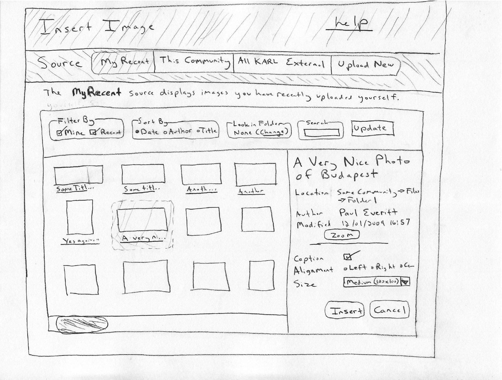

=====================================
Asset Linking and Uploading in Editor
=====================================

See `The video of the TinyMCE presentation
<http://blog.fourdigits.nl/tinymce-and-deco-at-the-plone-conference-2009>`
for an illustration of a new image/link tool for TinyMCE.

Use Cases
=========

- Upload and insert image while editing

- Linking to existing images or other resources, using various vectors
  (browse/search) to navigate

- Edit existing image and link references in the document

- Link to external image or resource

Out of Scope
============

- Bulk upload during editing

- Leaving any info for link checking and preventing broken links

- Internal anchors

Primary UI Challenge
====================

As Nat said, the goal is to have one button on the toolbar that
handles multiple kinds of media content that might be inserted (plus
another for managing links.)  Why should users know the difference
between the button icon for an image versus a YouTube clip?

The challenge is that this single button leads to a very divergent set
of goals, with different paths (browse vs. search) for realizing that
goal.  Moreso, there is a gap between a regular user (who might want a
task-based, wizard-like UI to walk through the complexity versus a
power user that wants a single screen.

Finally, we have a challenge in that we have to fit all this
complexity in a popup window with no scrolling.

We clearly have to make some choices between winners and losers,
picking at least one constraint and doing a good job at that choice.

This proposal optimizes for the average user and thus a task-oriented,
multi-panel interface.  This lets us effectively use limited screen
real estate by focusing on one "mode" at a time.  Likewise, we can
better use text to explain the UI, in web-page-like fashion.  On the
downside, multi-mode windows are sometimes discouraged.

Mockup Notes
============

We have a hand-written sketch of what you might see when clicking on
the editor button for inserting an image:

- The premise is that most of the time, people will be uploading new
  images during the course of writing.  Optimizing for this case is
  important.  It also means that navigating a big pile of existing
  KARL images is needed, but not the dominant usage.

- Clicking a button in the TinyMCE toolbar brings up the window

- Window borders: faint with no title bar.  Window can be dragged
  around, but starts centered.  Not resizable?

- Title area at the top, with shading and a link to "help"

- Below, a toolbar for the "sources" with different shading

- The "Source" toolbar uses like the "Radio button style toggle
  buttons set" example at:
  http://www.filamentgroup.com/lab/styling_buttons_and_toolbars_with_the_jquery_ui_css_framework/

- Sources

  - Clicking a button in the sources toolbar replaces the subpanel in
    the bottom.  All panels are there automatically, it just hides the
    current one and activates the other one.  (Very similar to tabs.)

  - Only one source can be chosen at a time (like a radio button)

  - Choice of a source sets a persistent cookie so that the next time
    you open the popup on another page, it is set there.

  - Each source has a single line of help text just inside the panel,
    explaining what it is showing.

- Defined Sources

  - "My Recent" defaults to date sort (reverse) lists all images I
    have recently modified/created, anywhere in the system.  Default
    sort choice is "Date", meaning reverse chronological order.

  - "This Community" shows all images anywhere in the current
    community.  Default sort choice is ascending title.

  - "All KARL" is all images anywhere in KARL that I have permission
    to see.  Default sort order is "Date", meaning reverse
    chronological.

  - "External" shows a panel similar to the current Insert Image in
    TinyMCE. A place to enter the URL, edit the title and other
    properties, and possibly a button to see a preview.

  - "Upload New" shows a panel allowing you to upload a new image from
    the file system.  The file gets added to the attachments subfolder
    inside the wikipage.  Also provide fields for the filename, size,
    caption, etc.

- Inside the panel is a toolbar with options to help narrow and
  navigate a big pile of images.

  - Because these changes trigger a bunch of data getting transferred
    (particularly important for low-bandwidth users), changes require
    clicking "Update" to change the display.

  - "Filter By" has checkboxes to narrow the current listing.  "Mine"
    shows only items created by me.  Much of the time, this will be a
    very effective way to narrow the pile.  "Recent" filters out
    anything older than, say, one week.  Again, a very effective way.

  - "Sort By" changes sort order.  Only marginally useful: we don't
    actually show the values of date/author/title so you have to click
    to see the preview of one image to know where you are.  Also, we
    don't allow reverse sorting.  Still, probably a useful addition
    with very little UI space taken.

  - "Look in Folder" (low priority) allows the focus to be narrowed to
    a folder in the community.  Clicking "change" brings up a window
    or panel or something that lists, alphabetically, all the folders
    in the system.  For example::

      Blog
      Calendar
      Files
      Files -> Folder 1
      Files -> Folder 2
      Files -> Folder 2 -> Subfolder A
      Files -> Folder 3
      Wiki

    Once this choice is made, it is squeezed into the display using
    truncation and mouse hovering.

  - "Search" is text search against something in the title.  Uses our
    search syntax, so you would have to do everi* to do a prefix
    search.

  - Again, the Update button makes changes in this toolbar take effect
    on the browser.

- The image browser shows rows and columns of thumbnails.

- We *might* choose to have part of the title displayed underneath.
  If so, we *might* choose to make that a hover target that shows more
  info.

- The sketch had those titles as underlined, but let's remove that.
  Instead, make the text very subdued, with a light gray.

- Clicking on an image marks it as selected, using a border and
  possibly a background color.

- The selected image shows information in the Info Panel on the right.
  The Info Panel is also where you edit the data needed for using the
  image in the current document.

- A "Zoom" button uses a lightbox effect to show a larger version of
  the image as a modal overlay.

- Caption, Alignment, and Size are the same as in Kupu.

- Hopefully navigation through batches is done with a smart horizontal
  scrollbar.

- Set a cookie to remember "preferences" on choice of source, filter
  options, etc.

- Re-opening the popup should leave it exactly the same state,
  including batch location, that it was after "Insert" or "Cancel".

- We should try *very* hard to avoid showing folder hierarchies.  It
  will require us to put things in to navigate and avoid getting lost.

- Just like Kupu, support generation of captioned images. (Low priority)

- All images will get a "preview" generated on saving.  The preview
  constrains to one size for portrait and one size for landscape.
  Target is around 5 Kb or less per preview.

- Take steps to improve speed of browsing through a big pile of
  images.  For example, each batch of images is just a node in a deck.
  As you go forward, you fetch new HTML for the next batch and add it
  to the items in the deck.  Going backwards, though, requires zero
  interaction with the server.  You're just showing HTML that was
  already there by moving the ``display:block`` pointer to an earlier
  div.

- Make sure that images get a placeholder height and width reserved
  for them, so the screen doesn't bounce around waiting for the image
  to arrive and get filled in.  Perhaps a very faint border style on
  the inclosing block.

- Sprinkle in some animation effects.  For example, "Insert" or
  "Cancel" could animate the collapsing of the box.

- Generate all sub-panels as server-side HTML, no JSON and client-side
  templating (to try to keep this test-able and easier for others to
  bugfix.)

- Longer term, provide some kind of option for low-bandwidth users.

- Since we're keeping the UI lean, put :hover to use to reveal more
  information.  But make sure it is only on a small target or use a
  timer to ensure the mouse stays in the block for a second.  Moving
  the mouse across the screen shouldn't trigger a ton of popups.

- As a crazy suggestion for improving performance, eliminate the 10-15
  extra HTTP requests for the images per batch by inlining the image
  data into the HTML itself,
  e.g. http://atunu.blogspot.com/2006/12/embedding-binary-data-in-inline-url.html
  A solution such as this would probably have a very positive impact
  on perceived performance.

- "Upload New" leads to images stored as attachments inside the
  document.  This removes some of the user experience complexity seen
  in Plone.TinyMCE and Kupu, where you have to navigate to a place to
  upload your images to.  Which then requires breadcrumbs to get back
  up.

- The "help" link leads to another subpanel for help, just the same as
  clicking one of the toolbar pushbuttons.

Specification
=============

- Ensure that the simplest case is simple.  Move most of the stuff
  nobody uses (e.g. a title attribute on an image) to an Advanced tab.

- For now, consider that we are going to store uploaded images as
  "attachments" to the document being edited.  Thus, the drawer
  doesn't need to allow navigating to a target for the place to upload
  to.

- Consider an option to generate "Dimensions" as in Rob Gietema's
  demo.  This would use the PIL we have for profile resizing to
  generate and use smaller versions of the image, while clicking would
  reveal a larger version.
