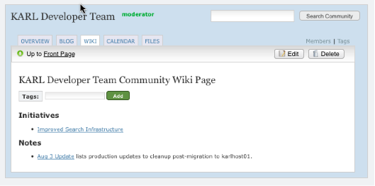

==============
WNG-1: Toolbar
==============

Summary: Introduce an attractive toolbar.

In this small initial step, we reserve UX (user experience) space and
set expectations for future work.

- Create a toolbar underneath the community tool tab.

- Put better designed actions box in there.

- Consider giving this treatment outside of communities.

UX Needs
========

What UX needs are being addressed in this step?  We are going to be
increasing the navigation richness in later work with more knobs.  We
already have some knobs scattered around.  We need to plan out later
work, then reserve space now to start gradually introducing the new
controls.

In this case, we need a concept of a "toolbar" that is bound to the
community tool (WIKI, in this case).  The toolbar will provide 3 main
functions:

- Simple navigation ("Up")

- Switching subviews

- Actions

We already have an actions box that is in a predictable part of the
screen.  We just need to integrate it.

As part of this work, it is important to get the details of the
interactions and styling down pat.  We will inherit these decisions
not just for WNG, but since we need consistency across the KARL UI
(e.g. the actions box), in other contexts as well.

Proposal
========

We will create a new space, just inside the community tab, that is the
toolbar for that tab:

In this mockup we see some UX elements and style touches:

- A toolbar with a gradient, context-sensitive to the tab/tool, has
  been introduced.

- The "Back to wiki" link has been replaced with the icon and a link
  to the "Front Page".

- The green actions box has been replaced with action buttons in the
  toolbar.

Some notes on the UX:

- Don't let this area get too "busy".  We'll keep most controls closer
  to the main content area.  Having a small set of consistent, useful
  controls is more important.

Futures
=======

We're doing this work first to make a gradual transition to
introducing new functionality into the UX.  Other things that will
appear in this toolbar later in the WNG process:

- By far the most imporant: an "Add Page" action, the topic of the
  next proposal.

- A pull-down button on the far left with a menu for all "advanced"
  actions.  Similar to how Confluence did it.

- Push-buttons for view selectors.  We'll have multiple ways to look
  at the Wiki.  Each of these views will be buttons similar to the
  Day/Week/Month/List buttons in the calendar, or the Feed filters.

