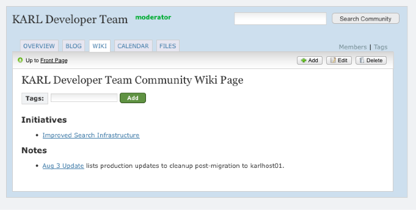
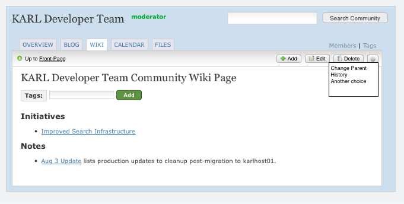
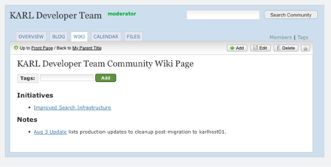

======================
WNG-2: Add Page button
======================

Summary: Make it easy to add a new page.

Users don't want Wikis, they want Pages.  More specifically, novice
users don't get the idea of highlighting a phrase in order to create a
document.

In this small step, we fix this primary problem.  Users can add a page
directly, but without sacrificing completely the interlinking of wiki.
Finally, we pave the way to later changing the word on the tool tab
from "WIKI" to "Pages", *if* we decide it is warranted.

UX Needs
========

For the most part, this is a very simple change in the user
experience, immediately obvious and welcome.  We put another action
button in the toolbar.

At the same time, we have a subtle issue to introduce into the UI:
"Parent".  (See next section for background.)  When
adding/viewing/editing a page, we might need to display some UX
control explaining this.  We might also need a way to edit a page and
re-parent it.

Background on "Parent" vis a vis folders
========================================

What makes a Wiki different than just Pages in a Folder?  Connections.
That is, Wiki forces you to choose a place (i.e. highlight some text)
and initiate the new page from that place.  Then, when creating the
new page, it remembers that starting point and considers the page of
the starting point the "parent".

This helps wikis be self-organizing.  You can auto-generate a table of
contents just by listing the parent/grandparent/etc. relationships.
In a way, you can think of this just like folders, subfolders, and
sub-sub-folders.

If this sounds a little like Reference Manuals and sections, that is
also a hierarchy.  In fact, a hierarchy that you can also put in
certain orders.  We'll revisit that in later proposals.

Alas, current KARL makes you pay the price of parenting (you have to
choose some text before adding a page) without giving the payback
(autogenerated table of contents.)

Proposal
========

Make a new action button called "Add Page":

.. note::

  We are *not* removing the existing facility where, inside the
  editor, you can highlight some text and make it a wikilink (or use
  the double parens manually.))

When you click "Add Page", the page you are on becomes the "Parent"
for the new Page.  By default, this fact is invisible during adding
and editing.  If you want to alter the parent information, you do so
via a toolbar option:

This menu option will allow editing the parent page, most likely with
an autocomplete widget of some type to choose the new parent.  The
editing can be done either with a new edit screen or a popup window
for inplace editing.

Now that we have parents, we need to change the navigation in the
toolbar to allow getting back to your "parent" (aka folder):

Rather than have two links there, the better solution is to get rid of
the "Back to Front Page" which is part of the current requirements.
The "WIKI" tab, sitting just 50 pixels away, does the same thing.  But
this mockup presumes it remains a requirement to have another way to
get to the top.

.. note::

  Currently, adding a wiki page does not give the option for editing
  the title.  It comes from the text you were linking.  When clicking
  "add page", though, the Add Wiki Page screen will need to allow
  providing a title.

  Under the hoods, this means we will need a completely different
  approach to managing links between pages.  A big architectural
  change.
