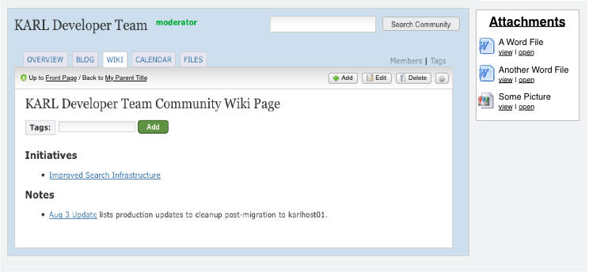
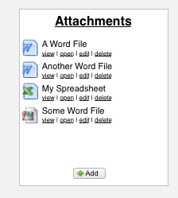
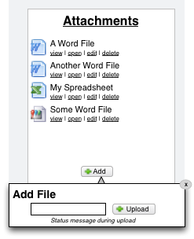

==========================
WNG-3: Attachments Portlet
==========================

Summary: Make wikipages a richer alternative to Folders through
browsing and managing attachments.

Users currently use the FILES tool for managing hierarchies (folders,
subfolders, sub-sub-folders) of files.  This is a very natural
approach for them, as it mimics their hard drive.

But KARL isn't a hard drive.  In addition to the FILES tool, we can
provide something that serves the same function while being more like
the Web, versus like a hard drive.  We can make Wiki Pages into
folder-like containers that provide a context and grouping for files
that are being collaborated on.  That is, files can be *attachments*
to a Wiki Page.

Since this is the core idea for WikiNG (WNG), this proposal gives
attachments a very visible spot in the UX: top part of the page, on
the right, in a portlet, always visible at the start of each page.

.. note::

  See :doc:`Core Features and Widgets <wng-core-and-widgets>` for an
  opinion on what parts to put in the portlet and what parts to be
  optional in a widget.

Proposal
========

Since images are already "attachments" to a Page, we already need a
way to browse and manage attachments.  Browsing is done by non-authors
(visitors to the community), while managing (add/edit/delete) is done
by authors (members of the community.)  We need a UX control that can
serve both audiences.

The portlets in the right column have proven to be seldom used, based
on traffic analysis.  Let's put them to use and have an Attachments
Portlet:

- List the images and files that are attached the document, along with
  quicklinks to visit the file or quickly open it.  (Might need more
  links?)

- Normal approach of chopping off titles with ellipsis if too long and
  showing the full title when hovering.

Authors see more controls:

- Quicklinks to edit and delete an item.  XXX Need to specify the user
  experience for clicking these links.  For example, does delete do an
  in-place deletion and redraws the portlet without loading the page?
  If so, is there a confirmation step?

- A button for adding a new file.

The latter leads to in-place upload, similar to imagedrawer:

- Clicking button makes an overlay appear just above.  Clicking
  outside of the overlay, or on the (x), closes it.  Use transition
  effects for opening and closing.

- If possible, do some styling on upload controls.

- Uploading the file makes a status message appear, similar to
  imagedrawer.

- Success closes popup and in-place reloads the attachments portlet.

- If possible, for browsers that support HTML5 FileAPI for
  drag-and-drop, make this a drop target.

Bulk Uploading
==============

Is this bulk uploading?  Not really.  It is more like Gmail's approach
to bulk uploading.  We make it very fast to upload a bunch of files,
albeit one-at-a-time.

Some ways to go further, for power users that need even more:

#. Get the Wiki tool to support email in.  If you have a bunch of
   files to upload to the wiki, attach them to an email.  The nice
   part: you don't have to wait while your browser spins, as it is
   asynchronous.  (Some obvious downsides though.)

#. Some browsers (IE, Safari, Chrome) support bulk uploading.  We can
   implement support for that, as noted above.  Then, allow power
   users to use a powerful browser if they truly need more.

#. Change the KARL requirements and allow Flash.  With Flash, we can
   do bulk upload using some add-ons.  Make no bones about it though:
   even the developers of the add-ons struggle to keep it working and
   avoid crashes.  There's a reason even the mighty Google doesn't
   support this in Gmail.

   The KARL development team couldn't support this function, we'd just
   have to use whatever was available as-is.

#. ZIP support.  For truly power users that can live with the other
   options, make a ZIP file and upload that.  We could then expand it
   on the server.

#. Make a dedicated desktop tool that people could download.  Least
   likely and least attractive alternative.
