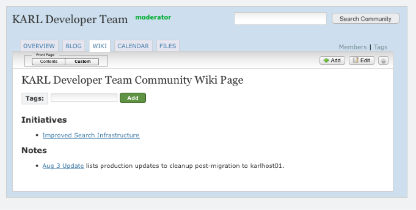
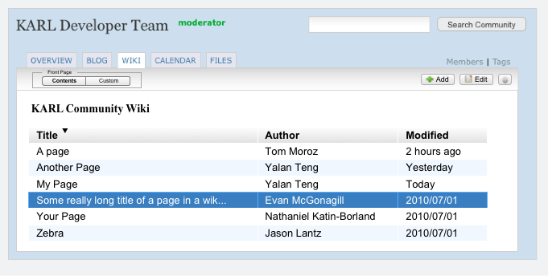

===============================
WNG-4: Simple Table of Contents
===============================

Summary: Eliminate the other major pain point of manually listing each
page in a wiki.

As mentioned earlier, the first big value on a wiki is that they are
self-organizing.  You create pages from a phrase on another page.
Wikis then generate a table of contents to each page, showing
relationships.

KARL doesn't do that.  Instead, KARL requires each community to
maintain a "front page" with links to all the pages.  Since some have
invested significant effort into these, we need to allow them to
continue.  But we need to support a core navigation mode that requires
no work.

.. note::

  There is a **lot** planned later for this view, particularl for
  related grids in widgets.  Still, we can address much of the pain
  quickly with a simple grid.

UX Needs
========

- Visitors want to browse all the content in a wiki in rich,
  performant ways.

- Authors don't want to manually maintain a table of contents that is
  usually out-of-date, either with dead links or unreachable content.

- Community moderators want flexible alternatives through widgets to
  provide alternate indices and navigation.

Proposal
========

Let's make a quick effort to alleviate the major pain point on using
wikis.  We can build into the core navigation an organized listing,
similar to the patterns we've established in Calendar, Communities,
and Feeds.  That is, a filterbox that drives a grid listing.

First the toolbar gets a change.  If you are at the top of the Wiki:

- No "Back to Front Page" link because you are on the front page.

- Instead, you get a filter box of views for the front page.  "Custom"
  (as shown here, bolded) gives the existing approach: a page you
  edit.  View selection, like elsewhere, is sticky.

- No "Delete" button because you can't delete the top page

Now for the new, autogenerated view:

- A grid with sortable columns and either pagination or virtual
  scrolling.

- In this first step, very simple.

Future
======

Either in these views or in widgets:

- Bring over Reference Manual approach to ordering and subsections
  (based on the "Parent" concept as a replacement for hierarchy).

- Once we have hierarchies that look like folders or like reference
  manual sections, we can drag-and-drop to move things around.

- Select and multiple select with delete support and inline Ajax
  updating.

- Some way to show attachments, to give partial support to appearing
  like a file browser.

- Inline editing of titles.

- Filtering to give client-side drill-down, e.g. letters in the title.

- Other psuedo-hierarchies: by tag, by author.
