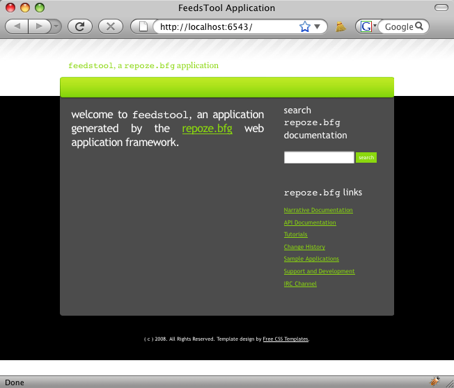

============
FEEDS Layout
============

As mentioned in the tutorial home page, our goal is to gradually
introduce KARL3 technologies in the creation of a new tool.

To avoid too much technology at once, we will actually start outside
KARL3.  Instead, we will use the sample project provided by
:mod:`repoze.bfg` which we created in the "Getting Started" step.

In this step, we modify the sample project to prepare it for
development of a FEEDS tool.

Objectives
==========

#. Modify the models and unit tests to use a FeedsContainer folder as
   the root object.

#. Change the ZCML configuration file to point at a FeedsContainer.

#. Alter the views and templates to reflect the new names, as well as
   the unit tests for the views.

#. Re-organize the template to use a common "layout" (ZPT macro) that
   we can share between templates, providing a common look-and-feel.

Before Making Changes
=====================

Let's make sure our sample application was setup correctly.  First, as
we will do regularly, let's run the unit tests:

.. code-block:: bash

  $ cd FeedsTool
  $ python setup.py test -q
  (lots of stuff deleted)
  ..
  -------------------------------------------------------------------
  Ran 2 tests in 0.153s

  OK

The first time we run the unit tests, a lot of development versions of
packages (eggs) are downloaded.  The second time we run tests, though,
it takes much less time.

As we can see, the tests run ok.  Next, let's fire up the application
and make sure it runs correctly:

.. code-block:: bash

  $ paster serve FeedsTool.ini --reload
  Starting subprocess with file monitor
  Starting server in PID 77246.
  serving on 0.0.0.0:6543 view at http://127.0.0.1:6543

Open a browser and go to ``http://localhost:6543/`` where you should
see:

Classes, Interfaces, and Tests in  Models
=========================================

The Paster template we used created a :mod:`repoze.bfg` project named
``FeedsTool``.  We would like to make some changes, first in the
"model" (the content):

- Instead of having the root object be a ``FeedsTool``, we want the
  root object to be a ``Site``.

- We plan to use interface declarations for Zope-style development, so
  we need an ``IFeedsContainer`` interface.  The ``Site`` class should
  say that it supports this ``IFeedsContainer`` interface.

- The tests should be changed to reflect this change, as well as
  adding tests for the interface.

Let's change ``feedstool/models.py`` to look like this:

.. literalinclude:: codesnippets/models-01.py
   :linenos:
   :language: py

#. *Lines 1-3*.  We import code for support of interfaces and the
   ``Folder`` class, which provides performant storage and retrieval of
   content.

#. *Line 5*. Make an interface that signifies a feed container.
   We can then attach behavior to objects that support this interface.

#. *Line 8-9*. The template made a ``FeedsTool`` class for the instance
   at the root of the site.  Let's call this ``Site``, and then say
   that instances of this class support the behavior of
   ``IFeedsContainer``.

#. *Line 13*.  Have the bootstrapping process create an instance of
   our ``Site`` class for the root.

To get :mod:`repoze.folder` into our development sandbox, we use
``easy_install``:

.. code-block:: bash

  $ easy_install -i http://dist.repoze.org/lemonade/dev/simple repoze.folder

When we run our tests, we see the errors we need to fix:

.. code-block:: bash

  $ python setup.py test -q
  (snip)
  ZopeXMLConfigurationError: File "/Users/paul/venvs/k3training/FeedsTool/feedstool/configure.zcml", line 6.2-9.7
    ConfigurationError: ('Invalid value for', 'for', 'ImportError: Module feedstool.models has no global MyModel')

  -------------------------------------------------------------------
  Ran 2 tests in 0.052s

  FAILED (errors=1)

This is to be expected: we changed some names of classes.  Let's fix
the tests first by editing the ``feedstool/configure.zcml``:

.. literalinclude:: codesnippets/configure-01.zcml
   :linenos:
   :language: xml

#. *Line 7 and Line 12*.  Instead of associating a view with a class,
   we associate a view with an interface. In this case,
   ``IFeedsContainer``.

Running the tests now leads to all tests passing:

.. code-block:: bash

  $ python setup.py test -q
  (snip)
  --------------------------------------------------------------------
  Ran 2 tests in 0.029s

  OK

We want to add some tests to the model to make sure our class lives up
to its "contract".  Add the following class to ``feedstool/tests.py``:

.. literalinclude:: codesnippets/tests-01.py
   :linenos:
   :language: py

This unit test makes an instance of a ``Site`` and makes sure it
supports the right interfaces.

Run the unit tests again and ensure that all tests pass.

With the models now working, let's do some cleanup on the views and
templates.

Views, Templates, and a Common Layout
=====================================

To continue fitting the sample application into our tutorial layout,
we'll next change the names of the existing view and templates to be
more meaningful.

In particular, we would like to have each template be as simple as
possible, sharing a common look-and-feel that is easy to apply to all
templates and maintain in the long-term.  In ZPT, this is achieved
through "macros".  In KARL3, each differently look-and-feel we use
(office, community, generic, etc.) are different "layouts",
implemented as a different ZPT macro template.

First we'll edit ``feedstool/views.py``:

.. literalinclude:: codesnippets/views-01.py
   :linenos:
   :language: py

#. *Line 3*. We will later need to load a new ZPT for the "layout"
   macro, so import the function that lets us load a template.

#. *Line 7*. Change the name of the view function from ``my_view`` to
   ``list_feeds_view``.

#. *Line 8*.  Load the "layout" template, containing the ZPT macro
   that controls look-and-feel across all pages.

  .. note::

     The ``get_template`` runs inside the view function, meaning it is
     executed on every request.  Isn't that a performance penalty?
     Fortunately not, as :mod:`repoze.bfg` provides caching of
     compiled templates.

#. *Lines 10-14*. Stop passing in the ``project`` value to the
   template rendering, and instead pass in a ``page_title`` as well as
   the ``layout``.

That's it for the changes to the view.  The template changes are more
substantial.

First, save the following as ``feedstool/templates/layout.pt``.  The
"layout" is a ZPT that defines a slot:

.. literalinclude:: codesnippets/layout-01.pt
   :linenos:
   :language: html

#. *Lines 5-6*. Add the ``metal`` namespace and say that the ``html``
   element is a ZPT macro named ``master``.

#. *Line 8*.  The HTML ``<title>`` will be a value passed in from each
   view, into the rendering.

#. *Lines 26-31*.  This is where most of the action is located.
   First, we ensure consistency between the ``<title>`` in the
   ``<head>`` and the visible "page heading" by reusing the same
   value.  We then define a slot named ``content``.  Each template
   that uses this layout thus fills this slot.

We now make a new ``list_feeds.pt`` template that "fills" the
``content`` slot in the layout:

.. literalinclude:: codesnippets/list_feeds-01.pt
   :linenos:
   :language: html

#. *Line 3-4*.  Bring in the ``metal`` namespace and have the
   ``layout.macros['master']`` take over.

#. *Line 6*.  We tell this ``
`` to have its content shoved into
   the ``content`` slot in the ``layout.macros['master']`` macro.

The ``configure.zcml`` needs to be pointed at the ``list_feeds_view``:

.. literalinclude:: codesnippets/configure-02.zcml
   :linenos:
   :language: html

#. *Line 8*.  Point at the renamed ``list_feeds_view`` function.

The unit tests now fail because we renamed the view function:

.. code-block:: bash

  $ python setup.py test -q
  (snip)
  ..EE
  ======================================================================
  ERROR: test_my_view (feedstool.tests.ViewIntegrationTests)
  ----------------------------------------------------------------------
  Traceback (most recent call last):
    File "/Users/paul/venvs/k3training/FeedsTool/feedstool/tests.py", line 89, in test_my_view
      from feedstool.views import my_view
  ImportError: cannot import name my_view

  ======================================================================
  ERROR: test_my_view (feedstool.tests.ViewTests)
  ----------------------------------------------------------------------
  Traceback (most recent call last):
    File "/Users/paul/venvs/k3training/FeedsTool/feedstool/tests.py", line 53, in test_my_view
      from feedstool.views import my_view
  ImportError: cannot import name my_view

  ----------------------------------------------------------------------
  Ran 4 tests in 0.028s

  FAILED (errors=2)

Edit ``tests.py`` and replace the six occurrences of ``my_view`` with
``list_feeds_view``.  Also, replace ``mytemplate.pt`` with
``list_feeds.pt``.

Running the tests again shows that the test expected ``project`` to be
passed into the template rendering.  Change line 59:

.. code-block:: python

  renderer.assert_(page_title='List Feeds')

This ensures that the HTML result of the rendering has a certain
string.

Running the tests should now show that 4 tests completed OK.

And to finish, let's now restart our application.  If you try to do so
and visit the URL, you might note that either the application won't
start or you get a ``Not Found``.  This is because we redefined the
root object to be a ``Site`` and mapped the default view for that
object to be interface-driven.

Thus, remove the ZODB files before restarting your application:

.. code-block:: bash

  $ rm Data.*
  $ paster serve FeedsTool.ini --reload

.. note::

  The ``--reload`` is **very** handy.  It tells the server to
  continously scan for code changes.  Any time Python code changes on
  disk, the server automatically restarts.

With this in place, your browser should now show the following screen:

.. image:: images/home02.png
