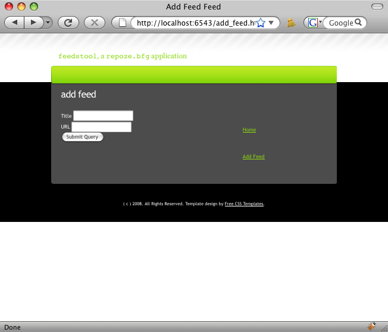

=========================
Add Forms and Persistence
=========================

As mentioned in the tutorial home page, we need a facility to add a
new feed to the feeds container at the root.  This means a link to a
form, a way to process the contents of the form, and update the
database.

Objectives
==========

#. Add a new view that handles requests both for getting the form and
   processing a submitted form.

#. Store instances of a feed.

#. Provide a listing of feeds in the feeds container.

#. View an individual feed.

This step, however, won't handle the actual retrieval of an Atom feed,
parsing it, and creating persistent feed entries.

About Forms in KARL3
====================

This tutorial does not use an architecture for form generation or
validation.  In the interest of simplicity, we just embed HTML form
elements into the ZPT and handle the values in the view.

KARL3 has a rather minimalist approach to forms, based on hard-earned
experience regarding the costs of premature generalization.
Specifically, while we believe in forms, we don't believe in
auto-generating them from schemas that describe content objects.  We
expect some forms to be laid out by hand and some to be laid out by
simple form libraries.  Simply stated, we're aiming low and allowing a
little extra typing to avoid the complexity of the big tools.  Mantra:
"Only pay for what you eat."

KARL3 also has a philosophy to use the popular Python WSGI tools, no
matter the provenance.  This led us to :mod:`tw.forms` which leverages
:mod:`FormEncode`.  We have become decreasingly attracted to the
former and increasingly attracted to the latter.  For performance and
complexity reasons, a switch might happen on removing :mod:`tw.forms`.

Thus, we don't plan to do any form machinery in the tutorial.

Feeding the Model
=================

As before, let's start in the model.  A ``FeedContainer`` is a
``Folder`` that should contain one or more ``Feed`` objects.  Let's
modify ``models.py``:

.. literalinclude:: codesnippets/models-02.py
   :linenos:
   :language: py

#. *Lines 11-12*.  Make a new interface ``IFeed`` that flags our Feed
   objects.

#. *Lines 14-21*.  Create a class for the implementation of ``IFeed``.
   Say that it implements the interface.  Make a constructor that
   first calls the superclass's constructor, then stores the ``title``
   and ``url`` as Unicode.

   We base ``Feed`` on folder because it will contain multiple
   ``FeedEntry`` objects later.

   .. note::

     If wanted to make assertions about the constraints on ``title``
     and ``url``, this would be a good place to do so.  We could raise
     exceptions in the constructor.  Alternatively, we could turn
     these into Python "properties" and consistently enforce the rules
     beyond the constructor.

Well, that was easy.  Let's update our unit tests to cover this new
interface and class.  Add the following unit tests to ``tests.py`` as
methods on ``ViewTests``:

.. code-block:: python

  class FeedTests(unittest.TestCase):

      def setUp(self):
          cleanUp()

      def tearDown(self):
          cleanUp()

      def _getTargetClass(self):
          from feedstool.models import Feed
          return Feed

      def _makeOne(self, title=u'title', url=u'url',):
          tc = self._getTargetClass()
          return tc(title, url)

      def test_class_conforms_to_IFeed(self):
          from zope.interface.verify import verifyClass
          from feedstool.models import IFeed
          verifyClass(IFeed, self._getTargetClass())

      def test_instance_conforms_to_IFeed(self):
          from zope.interface.verify import verifyObject
          from feedstool.models import IFeed
          verifyObject(IFeed, self._makeOne())

Running the tests should now show 6 tests passing:

.. code-block:: bash

  $ python setup.py test -q
  running test
  running egg_info
  writing requirements to FeedsTool.egg-info/requires.txt
  writing FeedsTool.egg-info/PKG-INFO
  writing top-level names to FeedsTool.egg-info/top_level.txt
  writing dependency_links to FeedsTool.egg-info/dependency_links.txt
  writing entry points to FeedsTool.egg-info/entry_points.txt
  reading manifest file 'FeedsTool.egg-info/SOURCES.txt'
  writing manifest file 'FeedsTool.egg-info/SOURCES.txt'
  running build_ext
  ......
  --------------------------------------------------------------------
  Ran 6 tests in 0.032s

  OK

So far, so good.  Now we make a new view to handle the add form.

Add Form View and Form Handler
==============================

Our ``views.py`` is about to get a bit more sophisticated, as this
will be our first case of processing incoming data:

.. literalinclude:: codesnippets/views-02.py
   :linenos:
   :language: py

#. *Lines 5-7*.  We need to import some modules for the add view,
   which we use later inside the function.

#. *Line 20*. Make a new view function for the add form.

#. *Line 24*.  We need a reliable way to detect if the form was
   submitted.  Simply presuming an HTTP method of ``POST`` isn't
   enough.  We double-check by making sure the form's ``submit``
   button was used.

#. *Lines 25-34*.  If the form was submitted, create a new Feed.

#. *Lines 26-28*. Grab the form data and create an instance of a Feed.

#. *Lines 30*.  Make a ``__name__`` id that becomes part of the URL.
   Use that name as the key to store in the dictionary (folder).
   Remember, the ``context`` is a ``Site`` instance.

#. *Line 33*.  We can do elementary debugging by printing to the
   console.

#. *Line 34*. Redirect to the newly-created Feed's default view.

#. *Line 35*.  If the form wasn't submitted, perhaps do some other
   processing and continue.

#. *Line 42*.  As a convenience to unit testing, stash the answer to
   the question of whether the form was submitted, into the keywords
   for rendering.  We'll use this below.

.. note::

  Note that we didn't attempt to do any form validation.  If we did,
  it would be inside the ``if`` around line 26.

  Also, Lines 26-28 get to the heart of "persistence" in ZODB versus
  other systems, e.g. schema-driven databases.  You could, if you
  wanted to, store anything you wanted on the object, without
  modifying the "schema" (class).

Next we make a ``templates/add_feed.pt`` template:

.. literalinclude:: codesnippets/add_feed-01.pt
   :linenos:
   :language: html

#. *Line 8*.  We use the :mod:`WebOb` request to get us the complete
   URL, down through the ``add_feed.html`` part.  We are following the
   "self-posting form" pattern, where we get and post to the same URL.

#. *Lines 9-14*.  A simple HTML form.

#. *Line 16*.  The ``@name`` of the submit button is important to the
   software.

We need a link on the home page to get to this screen.  Let's make it
a global link for now.  Add the second `<li>` into ``layout.pt`` as
show below:

.. code-block:: html

	

	  <ul>
	    <li>
	      <a href="/">Home</a>
	    </li>
	    <li>
	      <a href="/add_feed.html">Add Feed</a>
	    </li>
	  </ul>
	

Also, we need a new ``<view>`` registered in the ZCML configuration
(``configure.zcml``):

.. code-block:: xml

  <view
     for=".models.IFeedsContainer"
     view=".views.add_feed_view"
     name="add_feed.html"
     />

This attaches a new behavior to content that implements the
``IFeedsContainer`` interface, providing an ``/add_feed.html`` URL on
them.

Finally, we need some unit tests for this view we just wrote. Let's
add the following tests under the FeedTests Class in tests.py:

.. literalinclude:: codesnippets/tests-02.py
   :linenos:
   :language: py

#. *Line 1*. This unit test resembles the preview view tests.

#. *Lines 9 and 18*.  We test actually submitting the forms.

#. Due to tutorial time contraints, we won't be adding integration
   tests from this point forward.

Everything is in place.  Let's run the tests:

.. code-block:: bash

  $ python setup.py test -q (snip)
  --------------------------------------------------------------------
  Ran 9 tests in 0.061s

  OK

Make sure your paster server is running:

.. code-block:: bash

  $ paster serve FeedsTool.ini --reload
  Starting subprocess with file monitor
  Starting server in PID 78716.
  serving on 0.0.0.0:6543 view at http://127.0.0.1:6543

Go to ``http://127.0.0.1:6543/`` and click on the ``Add Feed`` link in
the right column.  You should see:

Filling this in and clicking ``Submit Query`` should work, although
result in an error when you are redirected to the unimplemented
default view for Feed.

Feed View and Feeds Listing
===========================

To wrap up our work, we need a default view for a Feed and a way to
list all the feed entries.

First, the view.  Add the following function to ``views.py``:

.. code-block:: python

  def show_feed_view(context, request):
      layout = get_template('templates/layout.pt')

      return render_template_to_response(
          'templates/show_feed.pt',
          request=request,
          layout=layout,
          page_title = 'Show Feed ' + context.title,
          feed_url=context.url)

#. *Line 1*.  A function to handle showing a feed.

#. *Line 8*. The ``context`` is the model object that was traversed to
   by the publisher.  In this case, it is a ``Feed`` instance, the one
   created by the submitted form that redirected us to this view.
   Grab the ``context.title`` and add it to the a string.

#. *Line 9*.  Our ZPT for this view wants to show a link to the feed
   as a placeholder.  Pass in the value as a top-level variable to the
   renderer.

.. note::

  :mod:`repoze.bfg` is easy to debug with the Python debugger.  Simply
  add the second line below after the first:

.. code-block:: python

  layout = get_template('templates/layout.pt') 
  import pdb;pdb.set_trace()

  When you visit a feed, you will get a PDB prompt in your server
  window where you can inspect the environment, make changes, etc.

Next, the templates for this view at ``templates/show_feed.pt``:

.. literalinclude:: codesnippets/show_feed-01.pt
   :linenos:
   :language: html

#. *Line 9*. Show the URL that was entered for the feed.

Add a ``view`` in the ZCML:

.. code-block:: xml

  <view
     for=".models.IFeed"
     view=".views.show_feed_view"
     />

Finally, another method on ``ViewTests`` in ``test.py``:

.. code-block:: python

    def test_show_feed_view(self):
        from feedstool.views import show_feed_view
        context = testing.DummyModel()
        context.title = "This Feed"
        context.url = "This URL"
        request = testing.DummyRequest()
        renderer = testing.registerDummyRenderer('templates/show_feed.pt')
        response = show_feed_view(context, request)
        renderer.assert_(page_title='Show Feed This Feed')
        renderer.assert_(feed_url='This URL')

Running the tests should now show 10 tests passing:

.. code-block:: bash

  $ python setup.py test -q (snip)
  --------------------------------------------------------------------
  Ran 10 tests in 0.061s

  OK

To get a listing of the known feeds, edit the ``list_feeds_view``
function in ``views.py``:

.. code-block:: python

  def list_feeds_view(context, request):

      layout = get_template('templates/layout.pt')

      feeds = []
      for feed in context.values():
          feeds.append({
                  'title': feed.title,
                  'model_url': model_url(feed, request),
                  })

      return render_template_to_response(
          'templates/list_feeds.pt',
          layout=layout,
          page_title='List Feeds',
          request = request,
          feeds=feeds)

Next, replace the ``<ul>`` in ``list_feeds.pt`` with some ZPT the
iterates over the list and makes links:

.. code-block:: html

    <ul>
      <li tal:repeat="feed feeds">
	<a href="${feed['model_url']}">${feed['title']}</a>
      </li>
    </ul>

Revisiting ``http://127.0.0.1:6543`` in your browser should provide a
listing of known Feed instances.

Measuring Performance With ``ab``
=================================

How does the performance stack up?  If you have Apache's ``ab`` tool
installed, we can do a load test:

.. code-block:: bash

  $ ./ab -n 200 -c 4 http://127.0.0.1:6543/
  This is ApacheBench, Version 2.3 <$Revision: 655654 $>
  Copyright 1996 Adam Twiss, Zeus Technology Ltd, http://www.zeustech.net/
  Licensed to The Apache Software Foundation, http://www.apache.org/

  Benchmarking 127.0.0.1 (be patient)
  Completed 100 requests
  Completed 200 requests
  Finished 200 requests

  Server Software:        PasteWSGIServer/0.5
  Server Hostname:        127.0.0.1
  Server Port:            6543

  Document Path:          /
  Document Length:        1583 bytes

  Concurrency Level:      4
  Time taken for tests:   0.584 seconds
  Complete requests:      200
  Failed requests:        0
  Write errors:           0
  Total transferred:      348200 bytes
  HTML transferred:       316600 bytes
  Requests per second:    342.57 [#/sec] (mean)
  Time per request:       11.676 [ms] (mean)
  Time per request:       2.919 [ms] (mean, across all concurrent requests)
  Transfer rate:          582.44 [Kbytes/sec] received

  Connection Times (ms)
                min  mean[+/-sd] median   max
  Connect:        0    0   0.1      0       1
  Processing:     3   11   3.5     11      21
  Waiting:        3    9   2.9      9      19
  Total:          4   12   3.4     11      22

  Percentage of the requests served within a certain time (ms)
    50%     11
    66%     13
    75%     14
    80%     14
    90%     16
    95%     18
    98%     19
    99%     21
   100%     22 (longest request)

As we can see, we are getting 342 requests per second on this test run.

