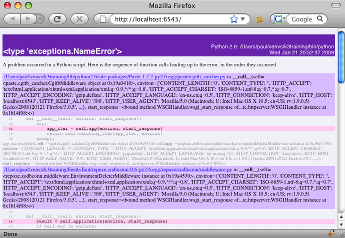

==================================
Feed Entries and New Module Layout
==================================

In this section we will be adding a new content type for feed entries,
corresponding to the content that is stored in a feed folder.  We use
this step to re-organize our package into the general structure seen
in :mod:`repoze.bfg` applications:

- ``feedstool/models/`` has a module per "type", along with modules
  that support the types.

- ``feedstool/views/`` also has a module per type, along with the
  ``templates`` subdirectory.

- Each directory has a ``configure.zcml`` included into the
  higher-level ZCML.

.. note::

  Starting with this tutorial, working (and versioned for each
  section) subtrees of the ``feedstool`` module source are included in
  the repository with the documentation sources for the tutorials.

Tasks
=====

#. Re-layout the models, including tests and a new content type (feed
   entry.)

#. Re-layout the views, including tests.

#. Update corollary files.

#. Add WSGI middleware to nicely format error pages.

Re-organized ``feedstool/models`` Directory
===========================================

To better reflect the naming conventions in KARL3, we start by
re-organizing the models.  Instead of a single ``models.py`` and
single ``tests.py``, we make files for each content type and a
``tests`` subdirectory for each type.  We also make a
``models/configure.zcml`` (empty for now) that manages the models,
plus a ``models/interfaces.py`` that has all the interfaces.

Visually, the directory hierarchy will look like this::

  feedstool/models/
    __init__.py (empty file)
    configure.zcml
    feed.py
    feedentry.py
    interfaces.py
    site.py
    tests/
      __init__.py (empty file)
      test_feed.py
      test_site.py

The ``models/configure.zcml`` is just a placeholder:

.. literalinclude:: feedstool-01/models/configure.zcml
   :linenos:
   :language: xml

The ``models/feed.py`` is terse, but includes some more information
about a feed for later use by the synchronization script:

.. literalinclude:: feedstool-01/models/feed.py
   :linenos:
   :language: py

#. *Line 8-18*. These are class attributes that serve as default
   values for ``Feed`` instances.  We store them on the class to avoid
   unnecessary bloat in the database.  More specifically, this
   information is provided with the feed XML is retrieved, not when
   the feed is added in the ``FeedsContainer``.

A feed stores one or more feed entries (per the Atom specification).
Thus we introduce the idea of a ``feedentry.py`` module:

.. literalinclude:: feedstool-01/models/feedentry.py
   :linenos:
   :language: py

This also makes liberal use of class attributes.  In theory, all
*required* feed entry element in the Atom specification would be in
the constructor.  All other data could be optionally added after the
instance was made.

.. note::

  Our philosophy is that the classes that are baked into the pickle
  should be as simple as possible.  They certainly shouldn't be
  expected to pick apart ``request`` data.  For the most part, we try
  to use adaptation to inject extra methods, computed properties, and
  other behavior (in the interest of keeping our model classes
  simple.)

The ``models/interfaces.py`` file is very simple:

.. literalinclude:: feedstool-01/models/interfaces.py
   :linenos:
   :language: py

The most complicated is the ``models/site.py``:

.. literalinclude:: feedstool-01/models/site.py
   :linenos:
   :language: py

#. *Lines 9-15*. We moved the ``appmaker`` function out of
   ``feedstool/run.py``.  Its job is to make an instance of the root,
   which is a ``Site``, so ``models/site.py`` is a logical place to
   put it.

The two modules holding the tests are relatively unchanged.  First,
``models/tests/test_feed.py``:

.. literalinclude:: feedstool-01/models/tests/test_feed.py
   :linenos:
   :language: py

And ``models/tests/test_site.py``:

.. literalinclude:: feedstool-01/models/tests/test_site.py
   :linenos:
   :language: py

Because we moved the ``appmaker`` bootstrapping function to
``models/site.py``, we have to update the startup module in
``feedstool/run.py``:

.. literalinclude:: feedstool-01/run.py
   :linenos:
   :language: py

We import the ``appmaker`` function from ``feedstool.models.site``.

Using :mod:`nose` For Test Suites
=================================

We now have our tests spread across multiple directories.  KARL3 uses
the :mod:`nose` package for improved unit test running, so let's
install it:

.. code-block:: bash

  $ easy_install nose

Now edit ``FeedsTool/setup.py`` and say that this package uses
:mod:`nose` as its test runner.  Do this by replacing the existing
``test_suite`` line with the following:

.. code-block:: ini

      test_suite="nose.collector",

KARL3 uses :mod:`nose` as its test suite runner.

Re-organized ``feedstool/views`` Directory
===========================================

The structure of the ``feedstool/views`` directory follows a similar
pattern::

  feedstool/views/
    __init__.py (empty file)
    configure.zcml
    feed.py
    site.py
    templates/
      add_feed.pt
      layout.pt
      list_feeds.pt
      show_feed.pt
      static/
        (static resources, same as before)
    tests/
      __init__.py (empty file)
      test_feed.py
      test_site.py

Because we put the interfaces into ``feedstool/models/interfaces.py``,
the ``views/configure.zcml`` has changes on each directive:

.. literalinclude:: feedstool-01/views/configure.zcml
   :linenos:
   :language: xml

The ``views/feed.py`` module holds the (currently one) view for
showing the contents of a feed:

.. literalinclude:: feedstool-01/views/feed.py
   :linenos:
   :language: py

The ``views/site.py`` gets most of the code:

.. literalinclude:: feedstool-01/views/site.py
   :linenos:
   :language: py

The ``views/templates/add_feed.pt`` template is unchanged:

.. literalinclude:: feedstool-01/views/templates/add_feed.pt
   :linenos:
   :language: html

Neither is the ``views/templates/layout.pt`` changed:

.. literalinclude:: feedstool-01/views/templates/layout.pt
   :linenos:
   :language: html

Nor is the ``views/templates/list_feeds.pt`` template:

.. literalinclude:: feedstool-01/views/templates/list_feeds.pt
   :linenos:
   :language: html

Finally, the ``views/templates/show_feed.pt`` is also unchanged:

.. literalinclude:: feedstool-01/views/templates/show_feed.pt
   :linenos:
   :language: html

We reorganized the view tests a bit, giving each unit test class a
name that corresponds to the module.  (In KARL3, each unit test
corresponds to a view.)  First, ``views/tests/test_feed.py``:

.. literalinclude:: feedstool-01/views/tests/test_feed.py
   :linenos:
   :language: py

Next, ``views/tests/test_site.py``:

.. literalinclude:: feedstool-01/views/tests/test_site.py
   :linenos:
   :language: py

Restarting Your Server
======================

As before, remember to delete your ``Data.*`` files before running
``paster server FeedsTool.ini --reload`` to start the server.  Why?
Because we changed the location of the class definition for the root
object.

Better Error Reporting
======================

In the case that you have caused a programming error so far, you
probably saw in your browser a ``Internal Server Error`` page, forcing
you to find the window where the server was running to see the
traceback.

Wouldn't it be great to have nicely-formatted tracebacks in the
browser?  :mod:`Paste` has such a thing.  Edit
``FeedsTool/FeedsTool.ini`` and add the ``egg:Paste#cgitb`` shown
below:

.. code-block:: ini

  [DEFAULT]
  debug = true

  [app:zodb]
  use = egg:FeedsTool#app
  reload_templates = true
  debug_authorization = false
  debug_notfound = false
  zodb_uri = file://%(here)s/Data.fs?connection_cache_size=20000

  [pipeline:main]
  pipeline =
      egg:Paste#cgitb
      egg:repoze.zodbconn#closer
      egg:repoze.tm#tm
      zodb

  [server:main]
  use = egg:Paste#http
  host = 0.0.0.0
  port = 6543

Next, go put an error in some view.  For example, put a random ``x``
in ``views/site.py``:

.. code-block:: python

  def list_feeds_view(context, request):
      layout = get_template('templates/layout.pt')
      x
      feeds = []
      for feed in context.values():
          feeds.append({
                  'title': feed.title,
                  'model_url': model_url(feed, request),
                  })

      return render_template_to_response(
          'templates/list_feeds.pt',
          request=request,
          layout=layout,
          page_title="List Feeds",
          feeds=feeds)

Now when you go to ``http://localhost:6543/`` you should see a nicer
error:

.. note::

  Perhaps you don't want your customers to see such an error message.
  Fortunately there are ways to address that, either in middleware or
  the external server.

  Perhaps, though, you want even *more* geeky message.  For example,
  whouldn't it be nice to have a clickable "debugger" that let you
  expand the stacks in the traceback?  That, also, is possible, using
  different middleware than ``Paste#cgitb``.

Side Note on ZCML
=================

Other frameworks, particularly "mega-frameworks" that use magic to do
a bunch of work it thinks you are asking for, eschew the idea of
configuration.  Instead, they tout the ability to use "convention",
namely statements right in the Python code the developer is writing,
to wire up the application.

Stated differently, why can't we eliminate the ugly XML and extra work
of ZCML?

We can do that in :mod:`repoze.bfg`, which supports Grok-style Python
decorators as a replacement for ZCML configuration.

Why aren't we using that in this tutorial, then?  Because KARL3
doesn't use it.

Why doesn't KARL3 use it?  Because of a great feature of ZCML that is
not only not possible in "convention", but simply counter-intuitive.
With KARL3, you can write new code that overrides existing code, from
the outside, without touching the existing code.  Want to make your
own ``show_feeds.pt`` template, or customize the view handling of just
the ``add_feed_view`` function?  With KARL3, you can write a new
Python package, get it registered in the ZCML, and modify the core
software.

That's a powerful feature, particular for the "pilots" model of KARL.

