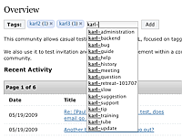
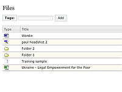
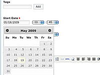
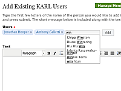
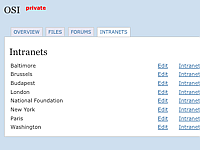

What's New In KARL3
*******************

The work in KARL3 went into 3 major areas:

* Performance, stability, reliability, quality
* Easier customization and enhancements in the future
* UI and feature improvements made in the course of the re-write

This document gives a visual guide on a few feature changes, then tours the
complete feature enhancement list as well as the architectural improvements.

Visual Guide
============

Tagging
-------

   Streamlined tag editing.

The "tagbox" allows viewing the tags listed on a resource, as well as showing
who tagged applied the tag. It also allows adding a new tag via a lookup, plus
deleting tags that you previously place.

The KARL3 tagbox is enhanced and streamlined to make editing your tags easier.
Also, the lookup is faster and the use of colors shows tags that you have
added. Finally, by popular demand, tagging is possible on add and edit
screens.

Files
-----

   Faster, better styled files management.

In KARL, many collections of resources are browsed using the "grid": batches
of data presented with sortable columns.

Many of the KARL3 grids have been significantly improved. The performance is
higher because the entire page is not reloaded. The layout is better styled
and sorting is more reliable.

Widgets
-------

   Improved widgets such as calendar.

Like many modern web applications, KARL takes advantage of Ajax widgets for
certain operations: LiveSearch, tagging, lookup tables, and navigating
collections. The Ajax system has been completely overhauled in KARL3,
leveraging the well-known jQuery and jQuery UI project.

As an example, the datepicker used on several calendar screens is faster and
shows better styling with transition effects.

Member Management
-----------------

   Members can be added to a community in one batch.

Moderators of a KARL community manage the community membership by adding
existing members, inviting new members, and other operations.

In KARL2, the most common operation (adding existing members to a KARL
community) was cumbersome. You had to add them one at a time, including the
message that for the email. In KARL3, we re-use the tagbox widget to allow
selecting multiple members at once, along with typing the email text just
once. They still get separate emails, but less work for the moderator.

Office Intranets
----------------

   UI for adding and editing offices.

Rather than configuring offices in code, with error-prone forums for each
office, this is now part of an administrative interface.

In KARL3, administrators can add new offices and edit information such as the
address, the portlets for the columns, and the navigation menu. Forums can
exist either within an office or up above the offices for general-purpose
forums.

Feature Improvements
====================

* **Tagging.** You can finally tag when adding or editing a resource. The
  display of tags is faster and more reliable because the initial data is
  present on the page, rather than loaded after the page. Visual styling
  is much improved through color-coded bubbles. Tag lookup is faster with
  an improved, more reliable Ajax infrastructure. Deleting tags is as
  simple as clicking the "x".
* **Community listing.** We now show "Last Updated" in the listing of
  communities, making it easier to identify active communities. The
  pagination box at the bottom is clearer.
* **Improved community membership.** "People" has been changed to "Members" to
  not clash with the global "People" link. Adding existing members can be
  done in one step.
* **Shorter email addresses.** The email addresses used for blog comments are
  no longer the "32 characters of noise" variety.
* **Sane attachments.** Attachments to blog entries and blog comments are now
  stored directly inside the blog entry/comment, instead of mirrored in
  the FILES tool via a brittle lookup.
* **Auto-login after invitation.** Processing an invitation (as well as
  recovering a password) automatically leads to the correct screen,
  skipping the intermediary login.
* **Improved error screens.** In KARL2, if you did not have permission to see
  a resource, the system gave a "Not Found" message. Instead, KARL3 says
  "Forbidden" to distinguish the two cases. Also, KARL3 has a friendly
  "Generic Error Message" screen instead of the dreaded purple Python
  error screen (the actual error is in an HTML comment if needed.) The
  login screen has more useful error messages.
* **Useful letter links.** The letter links when browsing certain listings
  only show a hyperlink if there are entries that match that letter.
* **Correct years on Network News/Events.** Rather than hard-coding a list
  (which stopped in 2008 in KARL2), dynamically generate a list of years.
* **All content managed in KARL UI.** Some operations in KARL2 required going
  to the Plone or Zope UIs. All operations now have a KARL UI screen.
* **Legal text is now content.** The terms and conditions, as well as the
  privacy text, are now managed as content via the KARL UI, rather than
  being external links.
* **Better calendar widget.** The datepicker is more attractive, faster, and
  more reliable.
* **Faster files navigation.** The grid-oriented batches, such as folders in
  the files tool, are more attractive and faster to navigate between
  batches (as well as sorting on columns.)

Architectural Improvements
==========================

KARL3 was a complete re-write. Along the way, we eliminated painful parts and
took advantage of the latest-greatest options available.

* **Performance.** Far faster performance consuming far less memory.
  Particularly faster on edits. Able to use multiple processors to get
  extra performance. Binary data stored on file system rather than in
  database.
* **Subsystems.** Eliminated many of the subsystems (Xapian, Tasty/Postgresql,
  Plone, XML/XSLT, etc.) that greatly increased complexity and decreased
  reliability and performance. On this front, KARL3 is lean, clean, and
  mean.
* **Ajax.** Switched from unmaintained, home-grown Ajax infrastructure to
  very-well-known, attractive, mature infrastructure. Works in Safari,
  faster, easier to maintain, doesn't popup a "Install MSXML4" popup on
  Internet Explorer.
* **Email in/out.** Email proved a very popular, but very frustrating
  (performance, reliability) aspect of KARL2. This subsystem was greatly
  improved. Emails are now processed very quickly. Shorten the very-long
  email addresses on blog commenting.
* **WSGI.** Take advantage of latest Python web architecture. Move aspects to
  what is called "middleware" and provide an option to run directly inside
  Apache.
* **No more XML and Unicode errors.** By eliminating the XML/XSLT layer, we
  banish the aggravating "XMLSyntaxErrors" that would pop up. This also
  greatly decreases the chances of errors from international characters.
* **More/better background processes.** More of the periodic operations were
  moved out of the public app server and into "cron" jobs that run in
  another process. These were designed to be easier to maintain and debug,
  in addition to not impacting performance of the main site.
* **Faster security edits.** Changing a community of folder to private doesn't
  wake up every child resource to modify its security.
* **Designed for consulting customization.** Previously, deep customization
  meant forking the code. Nearly all of KARL3 can be customized by
  overriding functionality using separate packages.

KARL Project Improvements
=========================

* **Open source.** The entire code base for KARL3 is open source. KARL3 itself
  is GPL.
* **Publicly managed.** The code is in a public repository, the developers
  share a mailing list and chat channel, and issues are tracked in
  launchpad.net
* **Commitment to tests.** The developers of the KARL3 project are committed
  to a solid regime of writing and running test suites. This is a very
  strong part of the development culture.
* **Diverse developers.** Developers from 7 organizations participated in the
  development of KARL3.
